# CamperControl Node-RED

Eigenständiges Repository für das CamperControl-Backend auf dem Victron Cerbo GX.
Die Ford-SYNC-QML-App liegt getrennt im Repository `sync3-camper`.

## Verzeichnisstruktur

- `flows/CamperControl_NodeRED.json` – aktueller und einziger Flow-Master
- `dashboard/camper-dashboard.html` – schlanke V2-only-Laufzeit und gemeinsame Live-Bindings
- `dashboard/camper-dashboard-v2.html` – Transit-Horizon-V2-Struktur mit Live-State/Commands
- `dashboard/camper-dashboard-v2.css` – aus der verbindlichen Touch-50-V2-Quelle übernommene Gestaltung
- `dashboard/assets/` – transparente Transit-Liniensymbole, identisch zur Ford-SYNC-App
- `cerbo-service/` – persistente lokale Cerbo-Dienste und Reparaturskripte
- `scripts/build-flow.js` – erzeugt den importierbaren Flow unter `dist/`
- `tests/validate-flow.js` – statische Gesamtprüfung ohne Hardwarezugriff
- `tests/runtime-readonly.js` – ausschließlich lesender Laufzeittest gegen den Cerbo
- `docs/` – technische Dokumentation

## Arbeiten mit dem Repository

```text
npm run build
npm run validate
npm run test:live
npm run preview
```

`npm run build` aktualisiert den Master deterministisch und schreibt den
importierbaren Export nach `dist/CamperControl_NodeRED.json`. Das Verzeichnis
`dist/` wird nicht versioniert, weil es jederzeit aus dem Master erzeugt wird.

`npm run preview` startet unter `http://127.0.0.1:4175/` eine ausschließlich
lesende Designabnahme. Sie setzt exakt dieselben drei Dashboard-Quellen wie der
Flow-Build zusammen und lädt bei jedem Seitenaufruf einen echten
`/camper/api/v2/state`-Snapshot vom Cerbo; sie besitzt keine Demo-Fallbackwerte
und sendet keine Gerätebefehle. Direkte Abnahme-URLs sind beispielsweise
`/?page=lights`, `/?page=energy&pane=sources` und
`/?page=energy&pane=solar-detail`. Mit `--cerbo http://172.24.24.1:1880` und
`--port 4175` lassen sich Quelle und Port explizit setzen.

## Interaktive Galerie

Die Screenshots stammen aus der ausschließlich lesenden lokalen 800×480-
Browserabnahme des aktuellen Flow-Masters. Jeder Bereich ist in Nacht- und
Tagmodus dokumentiert; die Lichtbilder zeigen den Balken zur Lageprüfung
eingeschaltet.

<details open>
<summary><strong>Home</strong></summary>

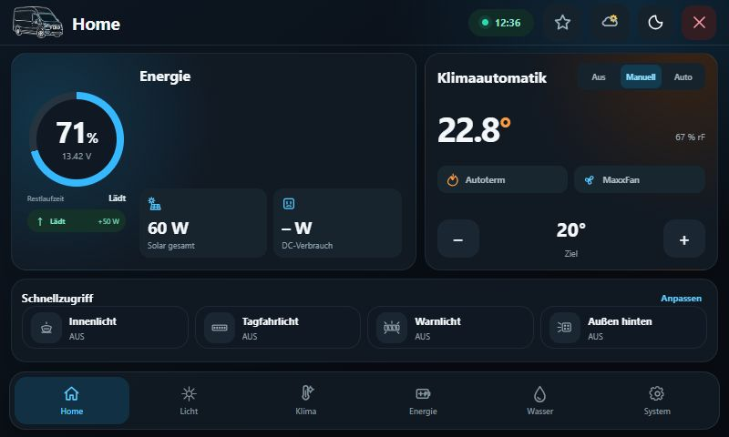

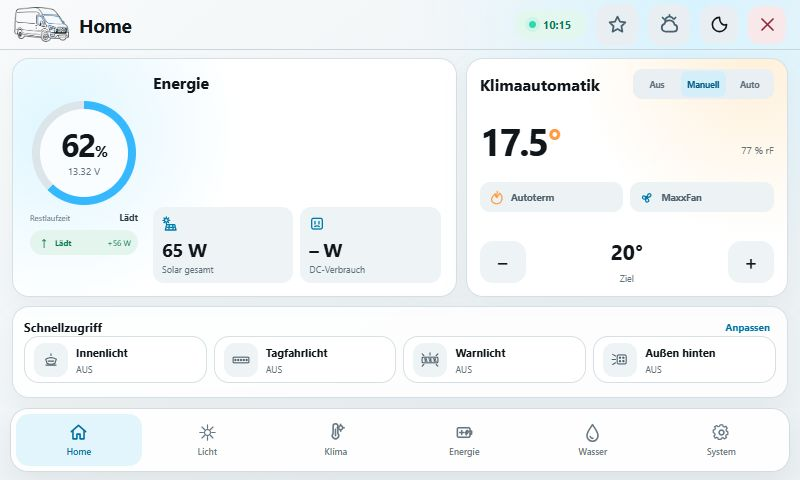

</details>

<details>
<summary><strong>Licht – Fahrer- und Beifahrerseite</strong></summary>

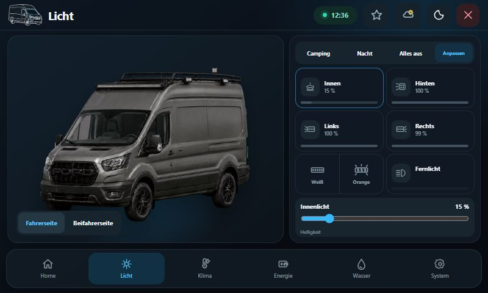

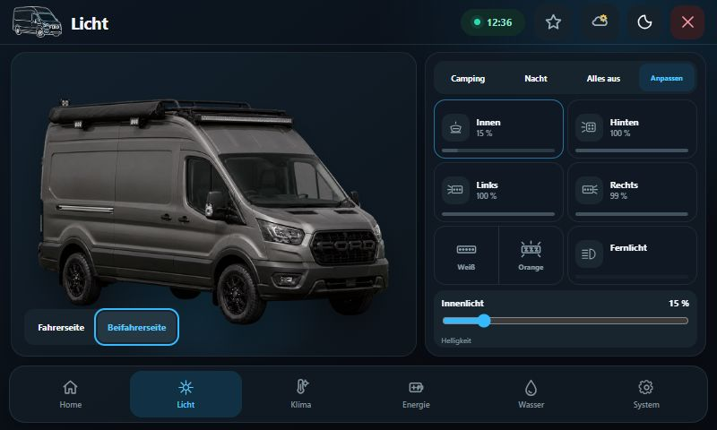

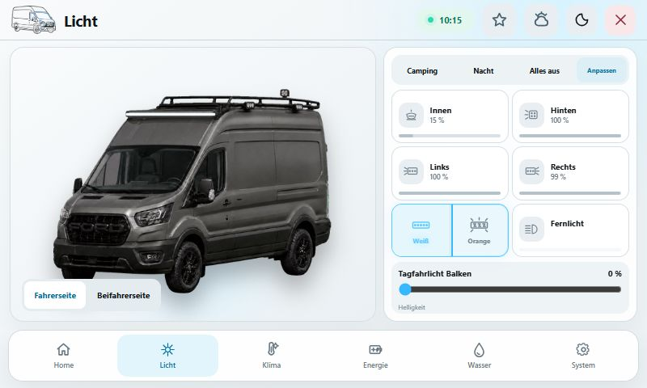

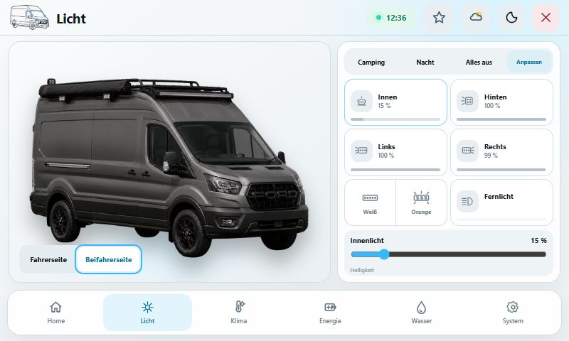

</details>

<details>
<summary><strong>Klima</strong></summary>

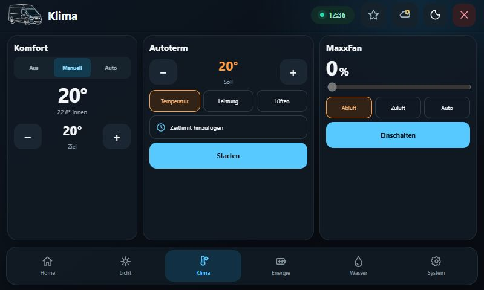

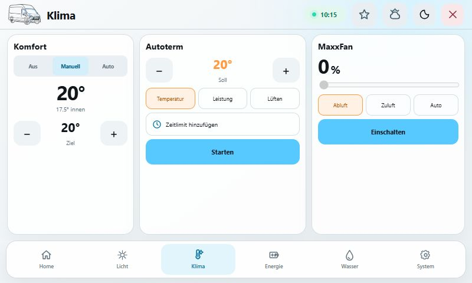

</details>

<details>
<summary><strong>Energie – Verbraucher und Quellen</strong></summary>

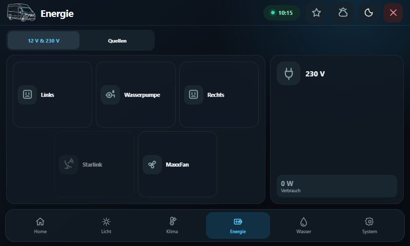

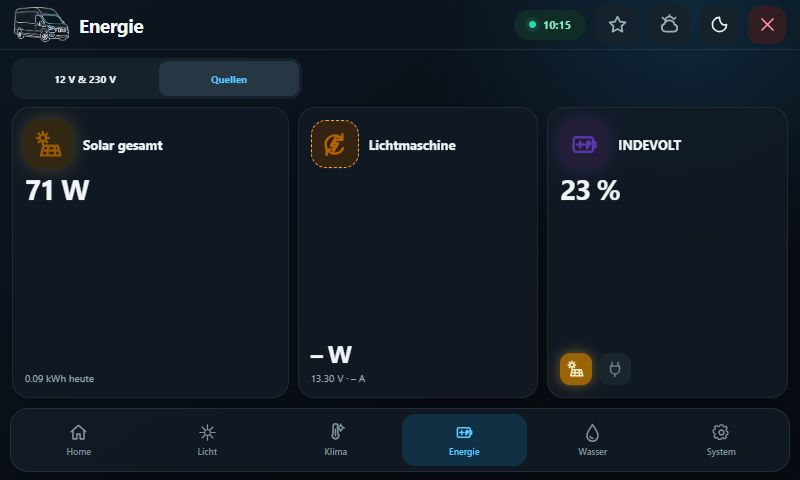

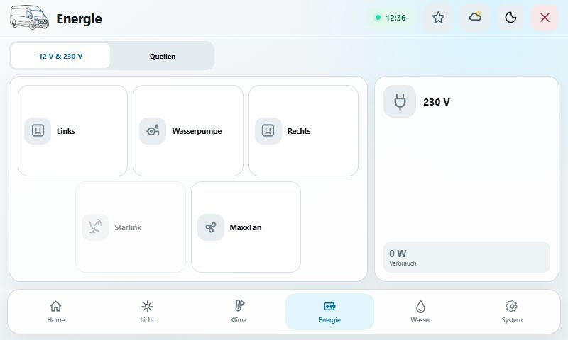

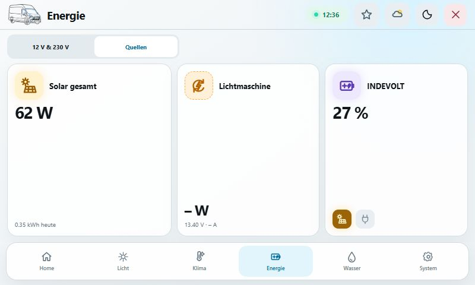

</details>

<details>
<summary><strong>Wasser</strong></summary>

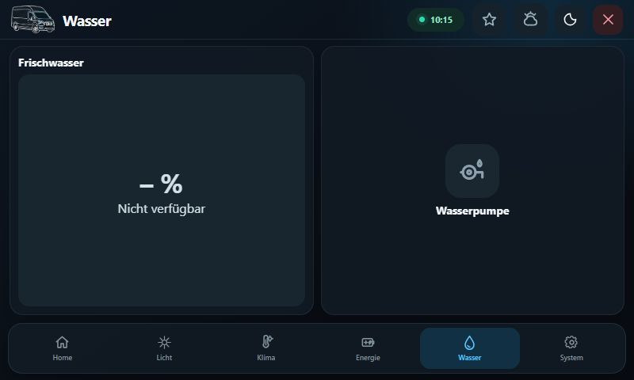

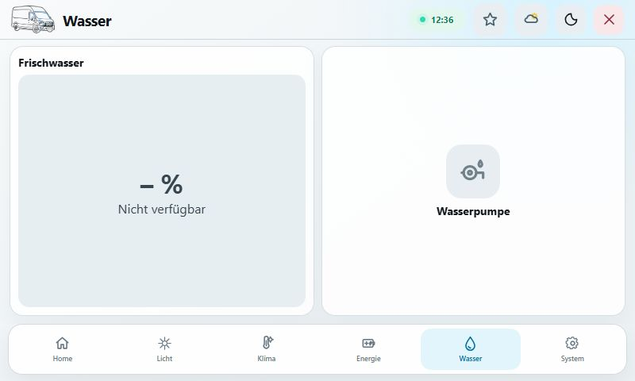

</details>

<details>
<summary><strong>System</strong></summary>

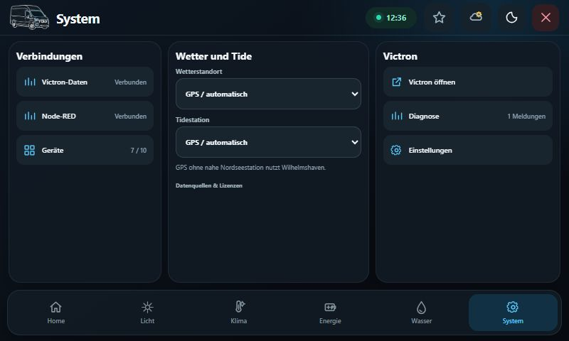

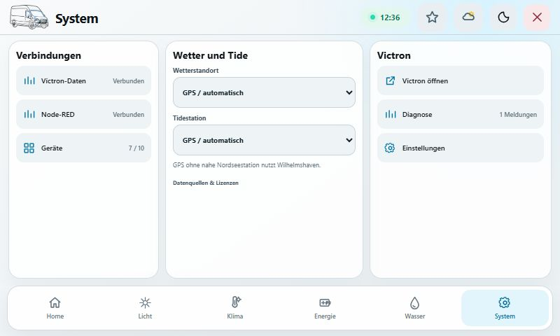

</details>

<details>
<summary><strong>Favoritenpanel</strong></summary>

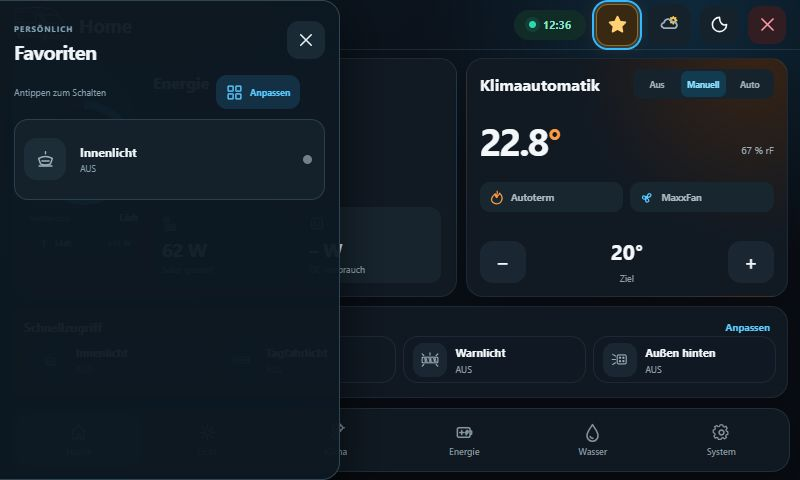

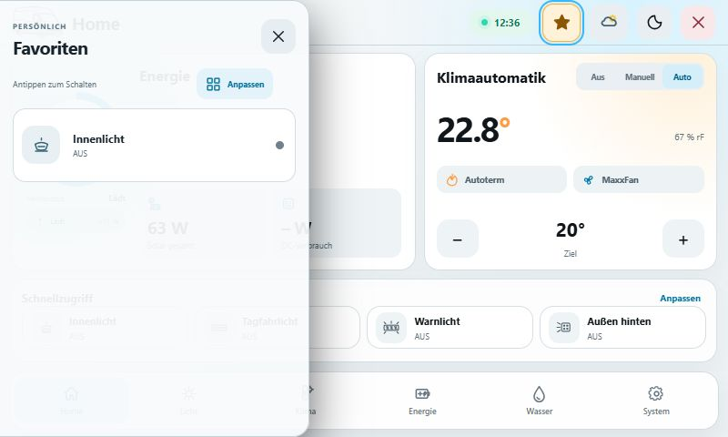

</details>

<details>
<summary><strong>Wetter- und Tidepanel</strong></summary>

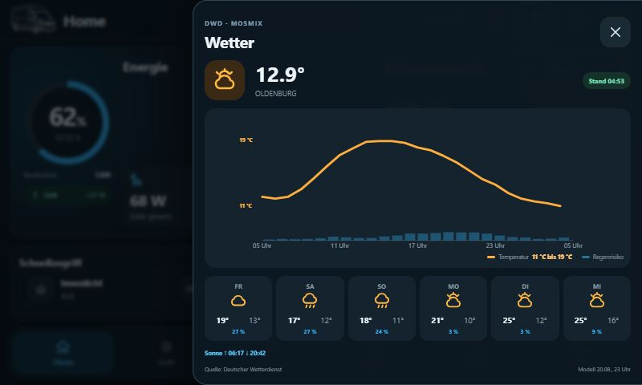

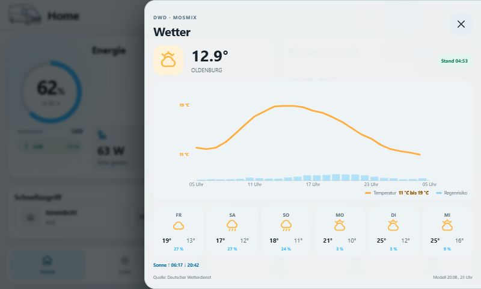

</details>

## Regeln

- Keine Passwörter, WLAN-Schlüssel, API-Tokens oder SSH-Zugangsdaten committen.
- Keine alten Flow-Kopien als zweiten Master ablegen; Änderungen werden über Git verfolgt.
- Victron-Geräte möglichst mit den offiziellen Victron-Node-RED-Nodes anbinden.
- Hardwarebefehle erst nach erfolgreicher Validierung und mit vorherigem Live-Backup deployen.
- Die lokale Camper-API verwendet HTTP auf Port 1880 und darf nicht ins Internet weitergeleitet werden.
- Weder gui-v2 GX noch WASM/VRM greifen direkt auf Port 1880 zu. Der eigene
  `com.victronenergy.campercontrol`-Dienst veröffentlicht kompakte Zustände und
  Befehle über die vorhandene D-Bus-/FlashMQ-N/R/W-Infrastruktur; Details stehen
  in `docs/vrm-remote-transport.md`.
- Derselbe Cerbo-Dienst lädt und cached die DWD-MOSMIX-Wettervorhersage zentral
  und veröffentlicht sie ausschließlich lesbar unter `/State/Weather`. GX,
  Remote Console und Ford SYNC greifen nicht selbst auf den DWD zu. Vertrag und
  Betrieb stehen in `docs/WEATHER_DWD.md`.

## Cerbo-CPU-Lüftung

- Relais 1 schaltet die Abluft, Relais 2 die Zuluft; beide laufen immer gemeinsam.
- Der manuelle Schalter hat Vorrang vor der Automatik.
- Die Automatik schaltet standardmäßig ab 65 °C ein und bei 60 °C wieder aus.
- Beide GX-Relais müssen in Venus OS auf `Manuell` konfiguriert sein.

## AUTOTERM-Kälteschutz und Meldungen

- Der Kälteschutz wird zentral unter Einstellungen konfiguriert und gilt für
  Node-RED, GX/Remote Console und Ford SYNC gemeinsam.
- Sicherer Standard: ausgeschaltet, Start unter 3 °C, Stopp ab 5 °C,
  Heizstufe 4 und fest zugeordneter Ruuvi B7B8 am Boden (`/25`).
- AUTOTERM-Initialisierung, aktuelle Batteriespannung und Unterspannungsschutz
  bleiben vor jedem automatischen Start wirksam. `Klima Aus` beendet keinen
  bereits vom aktivierten Kälteschutz übernommenen Heizlauf.
- CamperControl-Meldungen sind ein bestätigungsfreier Verlauf. Persistiert und
  über die API ausgegeben werden ausschließlich die letzten 25 Einträge.

## Transit-Horizon V2-only

- Das Dashboard enthält ausschließlich Transit Horizon V2 mit Home, Licht,
  Klima, Energie, Wasser und System. V1-Markup, Designauswahl und
  `ui.designVersion` werden weder ausgeführt noch im Snapshot veröffentlicht.
- Ein Wisch vom linken Bildschirmrand oder die 42-px-Sterntaste neben der Uhr
  öffnet das 340-px-Favoritenpanel. Rechts öffnen Edge-Wisch oder Wettertaste
  das 560-px-DWD-Panel. Die unsichtbaren Edge-Zonen bleiben ohne Griff;
  Gegenwisch, Hintergrund-Tipp und Schließen-Taste schließen das Panel.
- Home-Schnellzugriff (`state.ui.quickAccess`) und persönliche Favoriten
  (`state.ui.favorites`) sind getrennte, vom Cerbo persistierte Auswahlen. Beide
  verwenden den einmal veröffentlichten `state.ui.quickAccessOptions`-Katalog
  und denselben validierten Command-Resolver. `Anpassen` auf Home schreibt nur
  `ui.quickAccessIds`; der Editor im Sternpanel schreibt nur `ui.favoriteIds`
  (jeweils höchstens vier). Kurzer Tipp schaltet, langer Druck im Favoritenpanel
  öffnet die passende vorhandene Detailseite.
- Wetter wird nur aus `com.victronenergy.campercontrol/0 /State/Weather`
  übernommen (Schema 1, höchstens 16 KiB). Node-RED führt keinen Wetter-HTTP-
  Abruf und keinen Dashboard-Timer aus; `compact_state` transportiert Wetter
  nicht zurück zum D-Bus-Dienst.
- Alle D-Bus-, Settings-, Command- und Wetteranlässe laufen durch einen
  gemeinsamen Core-Gate mit höchstens zwei Snapshot-Auswertungen pro Sekunde;
  STAR-Power besitzt zusätzlich einen 1-Hz-Vorgate. Zwischen-Ticks werden ohne
  Queue verworfen, weil die Normalisierer den neuesten Wert bereits speichern.
  Ein inhaltlich identischer Snapshot wird weder persistiert noch erneut an die
  UI gesendet. Die lokale Bedienung aktualisiert Schaltzustände optimistisch,
  bis der zentrale Snapshot die Rückmeldung bestätigt.
- Die D-Bus-Bridge fragt den lokalen Zustand im Normalbetrieb mit 1 Hz ab. Bei
  einem hängenden Node-RED wartet sie nach Fehlern zusätzlich 1, 2, 5 und
  anschließend 10 Sekunden, statt den überlasteten HTTP-Port weiter zu fluten.
- Der Bridge-Befehl verlangt den Ursprung `vrm` oder `gx`. Bei `vrm` prüft der
  zentrale Router jede primitive Aktion vor dem Hardware-Dispatch und lehnt
  das Ausschalten von STAR-Power-Kanal 5 mit `remote_link_protection` ab. Das
  gilt auch für vollständig vorab geprüfte Szenen und eine auf Kanal 5
  konfigurierte Wasserpumpenroute. Einschalten aus VRM sowie Ausschalten auf
  GX, Ford SYNC oder lokal bleiben erlaubt.
- Persistente Historie ist zusätzlich zur Zeitbereinigung hart auf 4.685
  Punkte begrenzt: 24 Stunden Minutendaten, 30 Tage Viertelstundenwerte und
  365 Tageswerte. Das deckt Tagesdiagnose, Monatstrend und Jahresvergleich ab,
  ohne mehrere MiB alten Context auf dem Cerbo zu halten.
- V2 zeichnet auf dem GX Touch bei 800 × 480 und im Browser über die gesamte
  verfügbare Fläche ohne feste 800-px-Kappe, künstlichen Geräte-Rand oder
  schwarze Reststreifen. Das Transit-Liniensymbol besitzt in Tag und Nacht
  echte Transparenz und denselben kompakten FORD-Grill wie die SYNC-App.
- Die Schaltfläche oben rechts geht im Browser zuerst im Verlauf zurück,
  schließt ein von einer anderen Seite geöffnetes Fenster oder wechselt als
  sichere letzte Rückfallebene zur Victron-Startseite. Sie sendet niemals einen
  Geräte- oder Servicebefehl; System bleibt über die untere Navigation erreichbar.
- V2 enthält keine Messwert-Demos. Batterie, Solar, drei MPPT-Regler,
  INDEVOLT, Orion, MultiPlus, STAR-Power, Autoterm, MaxxFan und Wasser lesen den
  vorhandenen Snapshot. Nicht verfügbare Werte erscheinen als Strich; Orion
  und nicht bestätigte Schalter sind deaktiviert.
- Die Home-Kachel `DC-Verbrauch` folgt wie das originale Victron-Widget
  `Global.system.dc.power` exakt dem SystemCalc-Pfad
  `com.victronenergy.system /Dc/System/Power`. Die Batterieleistung folgt wie
  GX `Global.system.battery.power` aus
  `com.victronenergy.system /Dc/Battery/Power`, wird als
  `energy.battery.power` an Node-RED und SYNC verteilt und zeigt am SOC-Ring mit
  Richtung und Leistung, ob die aktive Systembatterie lädt, entlädt oder sich
  innerhalb der 5-W-Ruhezone befindet. Die daneben klar beschriftete Restlaufzeit kommt direkt
  aus `energy.battery.timeToGoSeconds`: ab 24 Stunden als Tage, darunter als
  Stunden; beim Laden steht `Lädt`, bei fehlender SmartShunt-Prognose `–`.
  `Solar gesamt` ist ausschließlich `com.victronenergy.system /Dc/Pv/Power`;
  INDEVOLT bleibt als getrennte Quelle in den Energiedetails sichtbar.
- Der Shelly 1PM Gen4 für die INDEVOLT-Netzfreigabe wird selbst erst mit 230 V
  versorgt. Fehlt `com.victronenergy.acload/50` bei ausgeschaltetem 230 V, ist
  das deshalb ein erwarteter Zustand; die Freigabe bleibt sichtbar deaktiviert
  und wird nicht als Cerbo-/Flowfehler gewertet.
- Orion `/Mode` wird als gelatchter Steuerzustand behandelt: Der letzte
  validierte Wert `1` oder `4` bleibt bei frischer Orion-Telemetrie gültig, auch
  wenn sich `/Mode` länger als das allgemeine 90-s-Datenfenster nicht ändert.
  Fehlt auch die Telemetrie, bleibt Orion konsequent offline; es werden weder
  ein alter Zustand noch ein erfundener D-Bus-Pfad angezeigt.
- Die Lichtseite nutzt die sechs konfigurierten Licht-IDs sowie den manuellen
  Fernlichtausgang, dieselben STAR-Power-Befehle wie V1, klickbare Foto-Hotspots
  und Karten sowie den permanenten Dimmer. Die beiden Fahrzeugbilder werden
  weiterhin unter `/camper-assets/VehicleLightsLeft.png` und
  `/camper-assets/VehicleLightsRight.png` vom bestehenden Flow ausgeliefert.
  Bild, sichtbare Lichtkörper und unsichtbare Touchflächen teilen ein einziges
  560×360-Koordinatensystem; die beiden Seitenlampen und die quadratische
  Hecklampe liegen dadurch direkt auf den realen Dachträger-Leuchten.
- Die Klima-Betriebsart ist ein Cerbo-eigener Dreiwegeschalter: `Aus` stoppt
  Autoterm und MaxxFan, `Manuell` gibt die Geräte für Einzelbedienung frei und
  beendet nur zuvor von der Automatik gestartete Geräte, `Auto` verwendet die
  vorhandene temperaturgeführte Regelung. Browser und Remote-Clients senden
  dafür ausschließlich den Settings-Intent `climateAutomation.controlMode`.
- `Camping`, `Nacht` und `Alles aus` besitzen Cerbo-eigene Lichtprofile unter
  `lightingScenes`. `Anpassen` auf der Lichtseite speichert je realem Lichtkreis
  `unverändert`, `aus`, `ein` oder 1–100 % über den vorhandenen Settings-Pfad;
  beim Speichern wird kein Hardwarebefehl gesendet. Beim späteren Start ersetzt
  das Profil ausschließlich die Lichtaktionen der Szene. Bereits vorhandene
  Nicht-Licht-Aktionen wie Wasserpumpe, 230 V, Autoterm oder MaxxFan bleiben
  erhalten und der zentrale Router prüft die gesamte Szene vor dem ersten
  Ausgang atomar.

## Lizenz

Der originale CamperControl-Code dieses Repositories steht unter der
[PolyForm Noncommercial License 1.0.0](LICENSE.md). Kommerzielle Nutzung ist
nicht erlaubt. Drittkomponenten sowie DWD-/BSH-Daten behalten ihre jeweiligen
Rechte und Attributionspflichten; Einzelheiten stehen in [NOTICE.md](NOTICE.md)
und [DATA-LICENSES.md](DATA-LICENSES.md). Aus Lucide abgeleitete
Navigationssymbole behalten ihre [ISC-/MIT-Lizenz](LICENSE-LUCIDE.txt).
